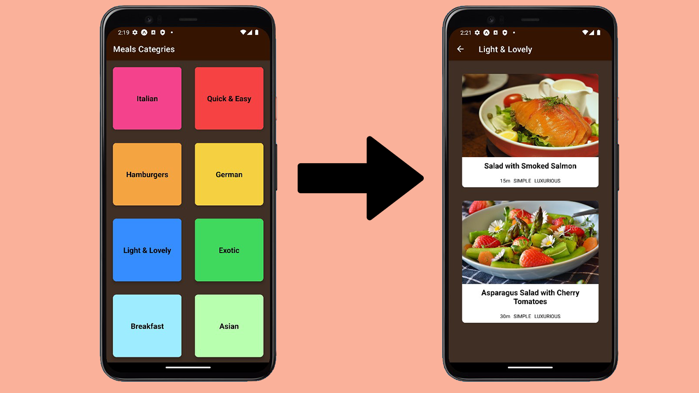

# Meals-App

This is a mobile app that shows many types of foods by categories like: countries, complexity, duration time for prepare and more!



#

This app was made with:
- React Native
- TypeScript
- JavaScript (Dummy Data)

## TODO

- [x] Set screens navigation
- [x] Create the detailed meal overvie page
- [x] Set the header buttons

## Run the app

After downloadig the source code, on your terminal type the following to install all the project dependencies:

``` yarn install ```
